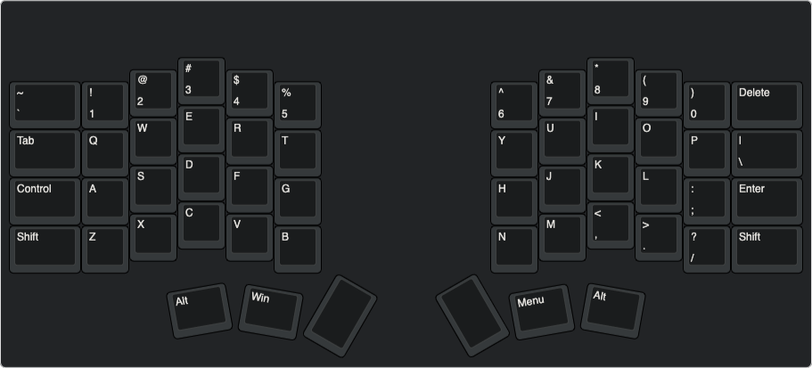
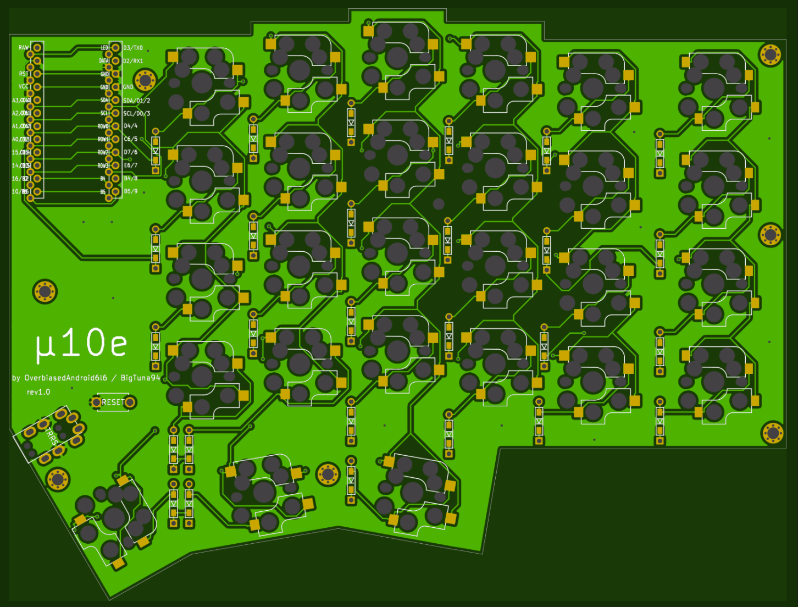
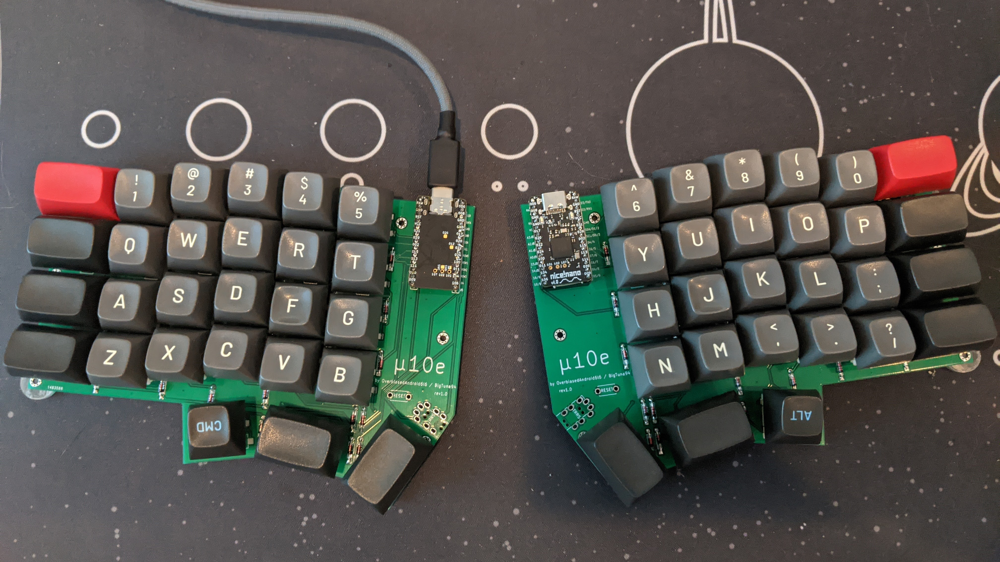
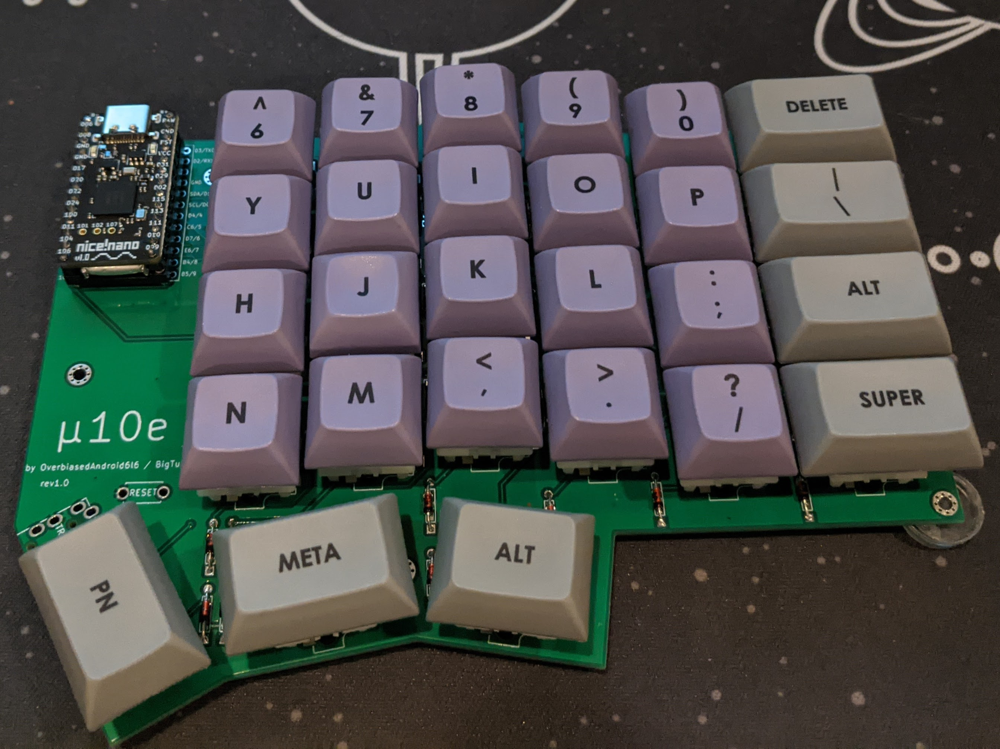
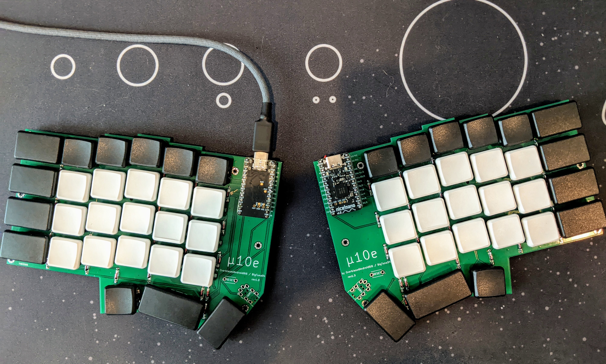
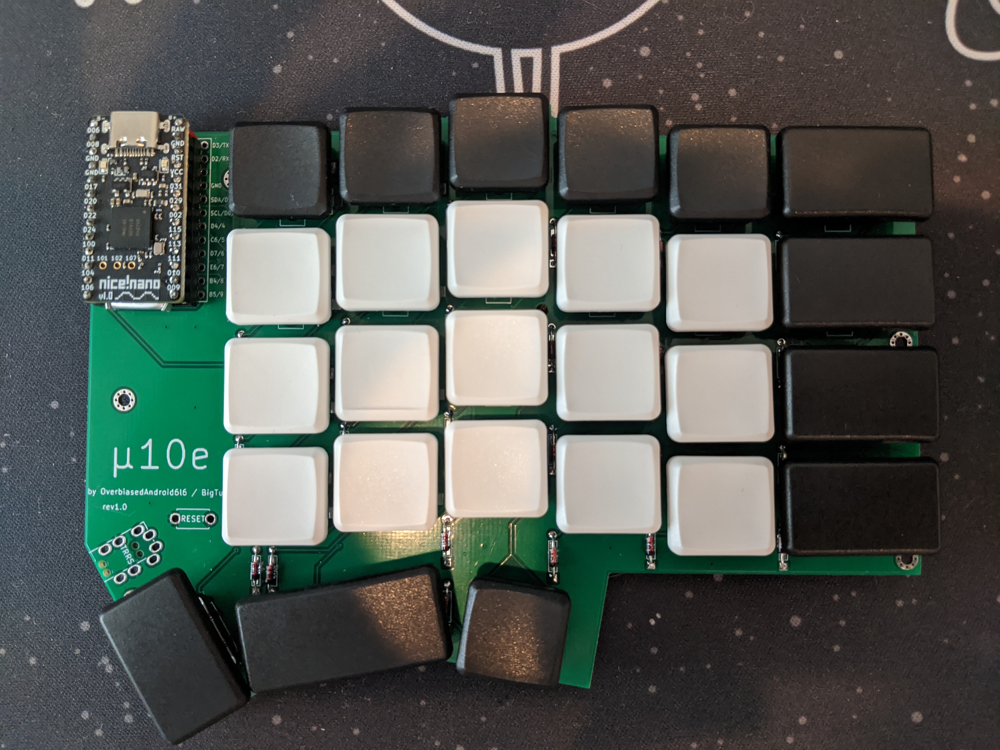
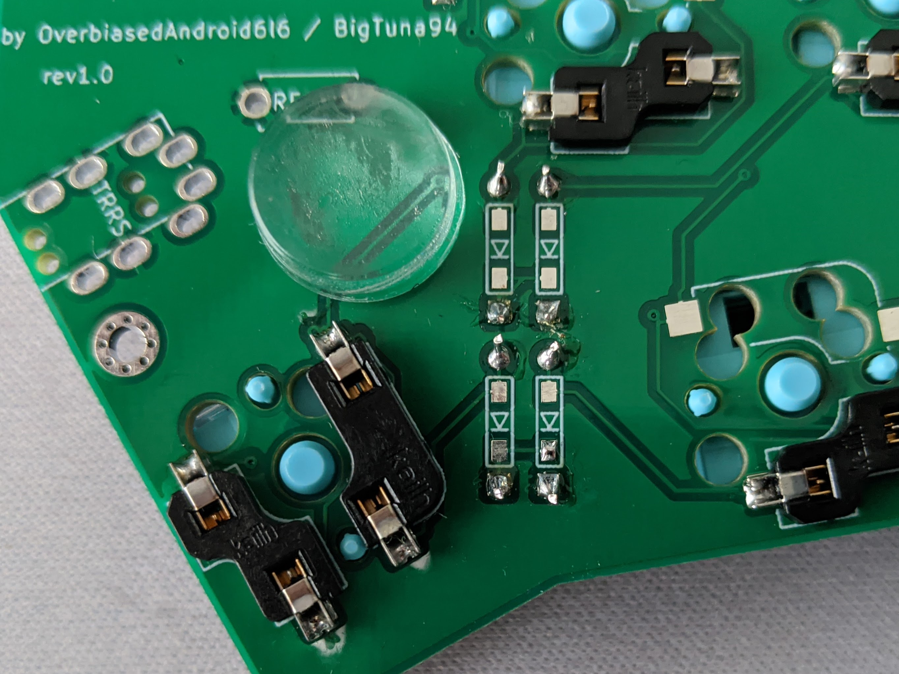

# μ10e

The μ10e, pronounced *Mutiny*, is another take on a DIY ergonomic ortholinear with column stagger split keyboard inspired by such boards as the ErgoDox, Crkbd, Splitreus62, and even the Planck and Boardwalk.

### Sample Layout

### Current PCB Design

### Goals
The initial inspiration for this board was a Crkbd with 1.5U modifiers, a number row, and Kailh Choc sockets. However, after seeing designs like the Lily58, I've decided it would be even better to support both Choc and MX sockets on the same pcb.

Although the first revision of this board will use a socketed Pro Micro footprint MCU per side, the overall goal of this project is something a little more sofisticated.

### Roadmap
- [x] Create initial schematic and pcb design using pro micro
- [ ] Gather feedback from community

### Potential Future Features
- Encoder footprint below controller
- Move TRRS footprint
- OLED footprint below contoller
- Built in MCU
  - The nice!nano and other new USB-C boards are really good right now.
  - Even though I like this idea, I'll see if there is community interest

### rev1.0 Images
#### MX Mounts

#### Choc Mounts

#### Socket Closeup

