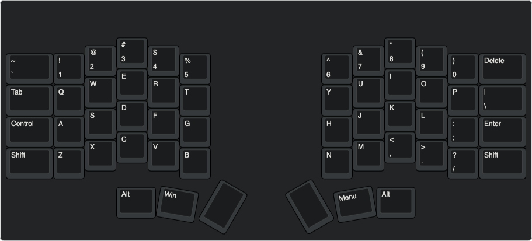

# μ10e

The μ10e, pronounced *Mutiny*, is another take on a DIY ergonomic ortholinear with column stagger split keyboard inspired by such boards as the ErgoDox, Crkbd, Splitreus62, and even the Planck and Boardwalk.

### Sample Layout
[Keyboard Layout Editor](http://www.keyboard-layout-editor.com/##@@_y:1&x:12;&=*%0A8;&@_y:-0.75&x:2.5;&=/@%0A2&_x:1;&=$%0A4&_x:5.5;&=/&%0A7&_x:1;&=(%0A9;&@_y:-0.75&w:1.5;&=~%0A%60&=!%0A1&_x:3;&=%25%0A5&_x:3.5;&=%5E%0A6&_x:3;&=)%0A0&_w:1.5;&=Delete;&@_y:-0.5&x:12;&=I;&@_y:-0.75&x:2.5;&=W&_x:1;&=R&_x:5.5;&=U&_x:1;&=O;&@_y:-0.75&w:1.5;&=Tab&=Q&_x:3;&=T&_x:3.5;&=Y&_x:3;&=P&_w:1.5;&=%7C%0A%5C;&@_y:-0.5&x:12;&=K;&@_y:-0.75&x:2.5;&=S&_x:1;&=F&_x:5.5;&=J&_x:1;&=L;&@_y:-0.75&w:1.5;&=Control&=A&_x:3;&=G&_x:3.5;&=H&_x:3;&=/:%0A/;&_w:1.5;&=Enter;&@_y:-0.5&x:12;&=%3C%0A,;&@_y:-0.75&x:2.5;&=X&_x:1;&=V&_x:5.5;&=M&_x:1;&=%3E%0A.;&@_y:-0.75&w:1.5;&=Shift&=Z&_x:3;&=B&_x:3.5;&=N&_x:3;&=?%0A//&_w:1.5;&=Shift;&@_y:0.25&x:11.75&w:1.25;&=Alt;&@_ry:0.25&y:0.75&x:3.5;&=#%0A3;&@_x:3.5;&=E;&@_x:3.5;&=D;&@_x:3.5;&=C;&@_rx:6.5&ry:7.25&y:-1.5&x:-3&w:1.25;&=Alt;&@_r:10&rx:8.25&ry:4&y:2.25&x:-3&w:1.25;&=Win;&@_r:30&y:-1.25&x:-0.5&a:7&h:1.5;&=;&@_r:-30&y:-1&x:-0.5&h:1.5;&=;&@_r:-10&y:-0.75&x:1.75&a:4&w:1.25;&=Menu)

### Goals
The initial inspiration for this board was a Crkbd with 1.5U modifiers, a number row, and Kailh Choc sockets. However, after seeing designs like the Lily58, I've decided it would be even better to support both Choc and MX sockets on the same pcb.

Although the first revision of this board will use a socketed Pro Micro footprint MCU per side, the overall goal of this project is something a little more sofisticated.

### Roadmap
- [ ] Create initial schematic and pcb design using pro micro
- [ ] Remove Pro Micro footprint and add dedicated MCU
- [ ] Add battery option
- [ ] Add fully wireless capability (current idea is IR)

